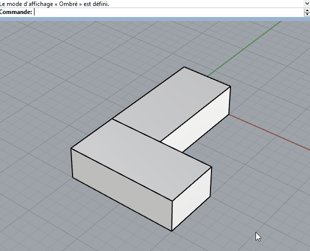

# A simple galbe roof utility for Rhino

This is a command that combines several classic commands to quickly create roofs.

- automatically extends the split line 
- can select height by number or point
- automatic ridgepole selection

